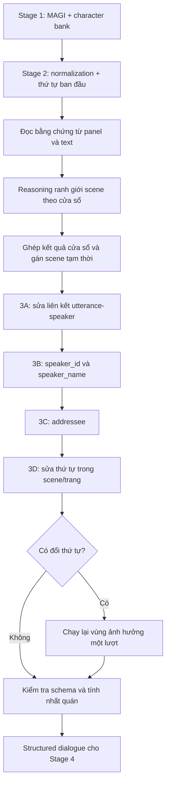

> Historical: describes the pre-refactor pipeline. Current usage is in ../news/usage.md.

# Thiết kế reasoning phân scene và Stage 3

Trạng thái: thiết kế đã được người dùng xác nhận sau phỏng vấn grill-me.
Ngày: 2026-10-01. Đây là thiết kế, chưa triển khai code hoặc tải thêm model.

## 1. Mục tiêu và quyết định đã chốt

- Mục tiêu nghiên cứu: đo xem phân scene bằng reasoning có cải thiện speaker/addressee hay không. Hiệu quả dịch thuật sẽ được đo riêng khi phát triển Stage 4–6.
- Ưu tiên local, gồm máy phát triển và máy thuê RTX 4080/A6000 hoặc mạnh hơn. Máy phát triển hiện tại là phương án dự phòng.
- Nạp/chạy model tuần tự; trước mắt cải tiến prompt và tích lũy nhãn đã sửa. Fine-tuning định kỳ là bước sau, chưa huấn luyện trong bản đầu.
- Dùng text và ảnh, bao gồm panel không có thoại. Một VLM đảm nhiệm các lượt reasoning với prompt/schema riêng.
- Scene là diễn biến liên tục về thời gian, không gian và tình huống tương tác. Đổi chủ đề hoặc đổi speaker đơn thuần không bắt buộc tách scene.
- Giữ speaker_id riêng với speaker_name. ID ổn định dù tên chưa biết hoặc được sửa.
- Cho phép unknown/needs_review. Tên/alias mới được đề xuất từ bằng chứng trong truyện hoặc hồ sơ nguồn, không tự cập nhật character bank.
- Stage 3D sửa thứ tự thoại trong cùng scene và cùng trang; giữ thứ tự trang. Không giao nhiệm vụ sửa ranh giới scene cho 3D.
- Sau khi 3D sửa thứ tự, được chạy lại 3A/3C cho vùng ảnh hưởng tối đa một lượt. Nếu 3A đổi danh tính ứng viên, đồng bộ lại kết quả 3B tương ứng.
- Bản đầu chưa thu thập dữ liệu hoặc triển khai đồ thị quan hệ/đặc tính nhân vật.
- Pilot gán nhãn độc lập khoảng 3–5 chương từ ít nhất hai bộ truyện.

Phương án đã xác nhận: xử lý offline theo chương, chia request bằng cửa sổ chồng lấn; có thể sử dụng dữ liệu ở phần sau của chương hiện tại, không tự lấy nội dung chương tương lai. Hồ sơ từ chương trước chỉ được dùng khi đã xác nhận và được cung cấp cho lần chạy.

## 2. Dữ kiện từ code hiện tại

- src/main.py xuất transcript, raw JSON và normalized JSON.
- src/dialogue_data.py giữ ảnh nguồn, panel/character boxes, bubble associations, source_text_ids/source_boxes và thứ tự ban đầu.
- speaker_cluster_id có namespace theo trang; speaker_id trong raw MAGI là identity từ character bank. Không đồng nhất hai loại ID.
- Character bank hiện có ID ổn định, display_name và luồng đổi tên. Chưa có graph hoặc luồng fine-tuning.
- normalize_document chưa suy luận scene, speaker hay addressee; scene_id đang trống.
- context_for_utterance giữ các câu lân cận, không loại context chỉ vì khác scene.
- tests/test_ollama_v2.py chia target thành batch nhưng vẫn gửi toàn bộ JSON nguồn mỗi request. Không tái sử dụng nguyên cách này cho reasoning dài.
- Mẫu đã duyệt có 36 utterance, hai ranh giới dương và một ranh giới chưa rõ. Chỉ dùng cho smoke test, không dùng để tuyên bố chọn model tốt nhất.

## 3. Pipeline tổng thể

Kết hợp scene với Stage 3 thông qua bằng chứng và context dùng chung. Giữ từng lượt và artifact riêng để truy lỗi và đánh giá. Không có vòng tự sửa scene từ Stage 3D.

## 4. Xử lý theo chương với context hữu hạn

Chương là đơn vị tổ chức dữ liệu và kết quả; không phải một prompt duy nhất.

1. Đọc từng nhóm panel/trang để tạo bản mô tả ngắn có ID bằng chứng. Giữ panel không có lời thoại, vì chúng có thể thể hiện chuyển thời gian/địa điểm.
2. Chia text và ảnh liên quan thành cửa sổ theo ngân sách context. Cửa sổ có phần chồng lấn và nhìn sang phía sau ranh giới đang xét.
3. Lưu quyết định theo utterance/panel ID. Phần chồng lấn chỉ cung cấp context; mỗi target có một chủ sở hữu để tránh xuất lặp hoặc bỏ sót.
4. Khi các cửa sổ bất đồng về cùng ranh giới, gọi lượt phân xử với bằng chứng hai bên. Nếu vẫn thiếu bằng chứng, giữ uncertain/needs_review.
5. Với scene lớn, Stage 3 cũng chạy theo cửa sổ. Lấy thêm context lân cận xuyên scene khi cần giải quyết hỏi–đáp, đại từ hoặc lời nói ngoài khung hình.
6. Kiểm tra toàn chương bằng code: coverage, ID, danh tính và các thay đổi. Mâu thuẫn cần semantic review được gom thành request nhỏ với bản ghi gốc tương ứng.

Trạng thái lưu ngoài model gồm dữ kiện đã xác nhận, giả thuyết chưa xác nhận, quyết định ranh giới, kết quả theo utterance và vị trí bằng chứng. Mô hình không được mặc định nhớ request trước. Tóm tắt là công cụ truy hồi; kiểm chứng phải quay lại ảnh/text gốc.

num_ctx giới hạn cả prompt, token ảnh, template và đầu ra. Ngân sách thử nghiệm cho request 16k: khoảng 8k đầu vào, 4k đầu ra, phần còn lại cho template/dự phòng. Đây không phải cấu hình đã benchmark hoặc bảo đảm vừa RAM. Batch planner cần giảm số ảnh/độ phân giải/context khi vượt ngân sách và ghi lại lý do; không tự cắt mất target.

Gemma đã cài khai báo context tối đa 131072 token, nhưng không cần cấp phát toàn bộ. Context lớn hơn tăng nhu cầu bộ nhớ: [Ollama context length](https://docs.ollama.com/context-length).

## 5. Reasoning phân scene

Đầu vào: ordered utterances ban đầu, page/panel IDs, OCR nguyên bản, content_type, geometry/associations MAGI và ảnh liên quan. Speaker MAGI là giả thuyết; không dùng như nhãn đúng chắc chắn.

Đánh giá từng khoảng giữa hai utterance, đồng thời xem panel trung gian, bằng các câu hỏi:

- Có bằng chứng chuyển thời gian, địa điểm, flashback hoặc chuyển sang diễn biến khác không?
- Câu phía sau có tiếp tục câu hỏi/câu trả lời, hành động hoặc đối tượng được nói đến trước đó không?
- Đổi người nói có chỉ là lượt thoại bình thường trong cùng tương tác không?
- Có đủ ảnh/text để kết luận hay chỉ suy đoán?

Đầu ra mỗi gap: boundary/no_boundary/uncertain, utterance IDs hai bên, evidence IDs và giải thích ngắn. Không yêu cầu model xuất chuỗi suy nghĩ dài. Điểm confidence nếu có chỉ là tín hiệu chưa hiệu chuẩn.

Chương trình gán scene_id theo các ranh giới đã hợp nhất; giữ ranh giới chưa rõ cùng trạng thái đề xuất. Ranh giới chưa rõ không được dùng để chặn cứng context. Đổi trang, đổi topic, đổi speaker hoặc nhãn Other không tự động tạo scene mới.

Đây là segmentation theo diễn biến manga. [Def-DTS](https://aclanthology.org/2025.findings-acl.1066/) gợi ý cách dùng ngữ cảnh hai chiều và ý định utterance cho suy luận ranh giới topic; cần thích nghi và đo trên manga, không coi kết quả của bài báo là bằng chứng trực tiếp cho hệ này.

## 6. Stage 3

### 3A — Correct speaker association

- Đề xuất sửa utterance → visual detection/cluster hoặc identity ứng viên dựa trên bubble/tail, bố cục, ảnh nhân vật và context thoại.
- Giữ association MAGI gốc riêng. Không tự viết lại face clustering hoặc character bank.
- Nhân vật không hiện trong panel vẫn có thể nói ngoài khung hình; không bắt buộc speaker phải là một detection đang nhìn thấy.
- Nếu bằng chứng không đủ, giữ unknown/needs_review. Không ép gán Other thành một nhân vật chung.

### 3B — Resolve identity and name

- Ánh xạ kết quả 3A tới ID trong character bank hoặc đề xuất identity chưa giải quyết.
- Giữ ID nguồn đúng kiểu và namespace của adapter. Với raw MAGI, speaker_id dùng ID bank hiện có; ID chuỗi của dữ liệu nhập ngoài phải được ánh xạ tường minh hoặc giữ riêng như source_speaker_id.
- speaker_name độc lập với ID và có thể null. Tên/alias lấy từ bank/hồ sơ hoặc bằng chứng rõ trong truyện; không dùng kiến thức nhớ của model làm dữ kiện chắc chắn.
- Đề xuất tên/identity mới lưu trong artifact review; chưa được duyệt thì không sửa bank. speaker_name chưa xác nhận có status riêng.

### 3C — Resolve addressee

- Xuất addressee_type và addressee_ids, kèm evidence/status.
- Phân biệt individual, group, self, unspecified và not_applicable trong schema đề xuất.
- Chỉ dùng ID hợp lệ hoặc đề xuất chưa giải quyết được đánh dấu riêng. Không tự đồng nhất người trả lời kế tiếp với người nghe duy nhất.
- Narration không bị ép có người nghe; thought có thể hướng tới bản thân hoặc người khác theo bằng chứng.
- Không suy luận quan hệ/đặc tính để xây graph trong bản đầu.

### 3D — Correct reading order within scene/page

- Được đổi thứ tự bubble và panel trong cùng scene, cùng trang. Không đổi thứ tự trang hoặc chuyển utterance sang scene khác.
- Dùng tọa độ, ảnh, hướng đọc và quan hệ tiếp nối hội thoại. Độ trôi chảy ngữ nghĩa đơn thuần không đủ để đảo câu.
- Lưu original_order, corrected_order, proposed_order và bằng chứng. Nếu chưa đủ bằng chứng, giữ thứ tự hiện có và needs_review.
- Kết quả phải là một hoán vị của đúng tập utterance nguồn: không tạo, bỏ, nhân đôi hoặc sửa text.
- Khi đổi thứ tự, chạy lại 3A/3C trên vùng có context bị thay đổi, gồm các lượt lân cận. Nếu identity đổi thì đồng bộ lại mapping/name của 3B.
- Tối đa một lượt chạy lại; không kích hoạt vòng 3D thứ hai hoặc sửa scene. Mâu thuẫn còn lại cần review.
- Bổ sung nhãn thứ tự đọc trong bộ pilot để đo riêng tác động của 3D.

Một validator cuối kiểm tra consistency toàn chương bằng code và request semantic nhỏ khi cần; nó không có quyền tự sửa scene hoặc phá ràng buộc thứ tự trang.

## 7. Output và provenance

Mỗi utterance giữ ít nhất:

| Nhóm | Trường |
| --- | --- |
| Nguồn bất biến | id, text, text_original, source_text_ids, source_boxes, page_id, panel_index |
| Scene | scene_id, scene_status, boundary evidence liên quan |
| Speaker gốc | original_speaker_cluster_id, original_speaker_id, original association |
| Speaker dự đoán | speaker_cluster_id, speaker_id, speaker_name, speaker_status, speaker_name_status |
| Người nghe | addressee_type, addressee_ids, addressee_status |
| Thứ tự | original_order, corrected_order, order_status; proposed_order khi chưa duyệt |
| Kiểm chứng | evidence_refs, short_reason, review_flags |

Metadata lần chạy gồm input fingerprint, model tag/digest, prompt/schema version, context/batch/image settings và thời gian chạy. evidence_refs phải trỏ tới utterance/panel/box có thật, không chỉ trỏ tới tóm tắt do model tạo.

Các trạng thái cần phân biệt: confirmed (được duyệt), predicted (model đề xuất), unknown (chưa biết) và needs_review (mâu thuẫn/thiếu bằng chứng). Không coi confidence tự báo cáo là xác suất đã hiệu chuẩn.

Raw/normalized JSON không bị ghi đè. Structured dialogue là artifact mới. Consumer Stage 4 phải đọc trạng thái để không coi speaker/addressee/tên chưa xác nhận là chắc chắn.

## 8. Mô hình và runtime đề xuất để benchmark

| Môi trường | Ứng viên | Chính sách tài nguyên |
| --- | --- | --- |
| Máy phát triển/CPU dự phòng | gemma4:e4b-it-q4_K_M hiện có; qwen3.5:4b là ứng viên nhẹ | Một request tại một thời điểm; context và ảnh nhỏ; checkpoint/cache từng lượt |
| Máy thuê RTX 4080 | qwen3.5:9b; đối chiếu Gemma hiện có | Một model tại một thời điểm; thử context khoảng 16k sau khi đo bộ nhớ |
| Máy thuê A6000 hoặc hơn | qwen3.5:27b; đối chiếu 9B | Profile GPU lớn; tăng context/batch chỉ sau khi đo, không mặc định nạp cả chương |

Đây là danh sách thử nghiệm, chưa chốt winner hoặc bảo đảm model vừa VRAM trong mọi cấu hình. [Qwen3.5 trên Ollama](https://ollama.com/library/qwen3.5) công bố text/image và dung lượng weights khoảng 3.4/6.6/17 GB cho các bản 4B/9B/27B. Dung lượng weights không bằng tổng bộ nhớ inference. [Gemma4 trên Ollama](https://ollama.com/library/gemma4) hỗ trợ multimodal và thinking.

Runtime dùng Ollama trước vì repo đã có client. Tách interface để có thể thay backend khi fine-tune sau. Không nâng dependency của MAGI tại chỗ để nạp model reasoning.

Configuration cần tách model tag/digest, context cap, output cap, image limit/resolution, overlap, retry limit, thinking mode và unload policy. Giải phóng MAGI trước khi chạy VLM nếu cần dùng chung bộ nhớ. Đổi model phải ghi log, không âm thầm đổi trong một thí nghiệm.

Dùng JSON schema và validator riêng cho từng lượt. [Ollama structured outputs](https://docs.ollama.com/capabilities/structured-outputs) hỗ trợ truyền schema; schema hợp lệ không bảo đảm reasoning đúng. Thử thinking on/off như biến thí nghiệm, giới hạn đầu ra để tránh chi phí không kiểm soát.

## 9. Pilot và đánh giá

Gán nhãn độc lập cho 3–5 chương, gồm scene boundaries, speaker association/identity, tên có bằng chứng, addressee và thứ tự đọc. Cho phép ambiguous/unknown và ghi lý do. Chốt hướng dẫn gán nhãn trước khi dùng dự đoán của model để tránh biến output model thành gold.

Tách development và test theo chương; nếu dữ liệu cho phép, giữ cả bộ truyện riêng để kiểm tra khái quát. Không tune prompt bằng test. Với pilot nhỏ, báo cáo kết quả theo từng chương và ví dụ lỗi; chưa tuyên bố khái quát production.

Các cấu hình cần so sánh:

1. Stage 3 không có explicit scene segmentation, vẫn dùng cửa sổ và ảnh.
2. Stage 3 với scene reasoning, giữ thứ tự MAGI ban đầu.
3. Scene reasoning + 3D sửa thứ tự và lượt chạy lại cục bộ.
4. Scene gold + Stage 3, dùng như oracle để ước lượng tác động của lỗi phân scene.

Giữ cùng model, ảnh nguồn và ngân sách xử lý hợp lý giữa các cấu hình; ghi rõ mọi khác biệt. Cấu hình feedback tự sửa scene trước đây bị loại, không dùng như một quyết định đã chốt.

Chỉ số: boundary precision/recall/F1 và sai lệch segmentation; speaker correction precision/recall, identity accuracy; addressee type accuracy và ID-set precision/recall/F1; reading-order pairwise accuracy; unknown/needs_review coverage; false corrections trên dữ liệu MAGI vốn đúng; JSON validity; thời gian/token/bộ nhớ theo chương. Báo cáo cả tỷ lệ abstain để tránh cải thiện accuracy bằng cách không trả lời nhiều trường hợp.

Chỉ chọn model/profile sau khi đo trên bộ pilot. Mức cải thiện speaker/addressee không tự chứng minh giảm lỗi dịch/xưng hô; Stage 4–6 cần đánh giá downstream riêng.

## 10. Thứ tự triển khai sau khi xác nhận

1. Schema/provenance, adapters và hướng dẫn gán nhãn.
2. Client VLM có schema, batch planner, cache/checkpoint và kiểm tra ngân sách ảnh/context.
3. Đọc bằng chứng thị giác và reasoning scene; xử lý overlap/bất đồng.
4. Stage 3A, 3B, 3C với unknown/review và bảo toàn dữ liệu gốc.
5. Stage 3D và lượt chạy lại cục bộ có giới hạn.
6. Validator, pilot, ablations và benchmark model/profile.
7. Thu thập bản sửa đã duyệt thành dataset; quyết định fine-tune ở vòng sau.

Các module dự kiến: reasoning_client.py, reasoning_batching.py, scene_reasoning.py, dialogue_reconstruction.py, dialogue_ordering.py và reasoning_evaluation.py. Đây là tên module thiết kế, chưa tạo code.

## 11. Giới hạn, phương án bị loại và việc để sau

- Không gửi toàn bộ JSON chương vào mọi batch; không giả định context lớn là giải pháp cho máy ít RAM.
- Không triển khai nhiều model chuyên trách hoặc ensemble ngay từ bản đầu.
- Không tự sửa character bank, không ép unknown thành danh tính chắc chắn.
- Không giao sửa scene cho 3D, không lặp đến khi model tự đồng thuận.
- Không đổi thứ tự giữa trang, không đảo câu chỉ để tạo hội thoại hợp lý.
- Chưa làm graph/đặc tính nhân vật, fine-tuning hoặc QA dịch đầy đủ.
- Lỗi reading order ban đầu có thể khiến phân scene sai trước khi tới 3D. Bản đầu ghi nhận và đo lỗi này, đưa trường hợp nghi ngờ vào review; không tự giải quyết bằng một vòng sửa scene chưa được cho phép.
- Cửa sổ hữu hạn và tóm tắt có thể bỏ mất bằng chứng xa. Lưu nguồn và truy hồi theo ID giúp kiểm tra lại, không bảo đảm tránh mọi lỗi.
- Mô hình đọc ảnh có thể hiểu sai bubble/tail hoặc bối cảnh. Đầu ra cần evidence và kiểm tra độc lập.
- Winner, context/batch tối ưu, ngưỡng chấp nhận tự động và kế hoạch fine-tune là kết quả cần đo sau, chưa phải kết luận của bản thiết kế này.

## 12. Xác nhận

Người dùng đã xác nhận sử dụng bản thiết kế này ngày 2026-10-01, bao gồm xử lý offline theo chương bằng cửa sổ chồng lấn. Phỏng vấn grill-me đã hoàn tất; tài liệu là cơ sở cho bước triển khai tiếp theo. Phiên thiết kế chưa triển khai code, tải thêm model, fine-tune hoặc push thay đổi.
