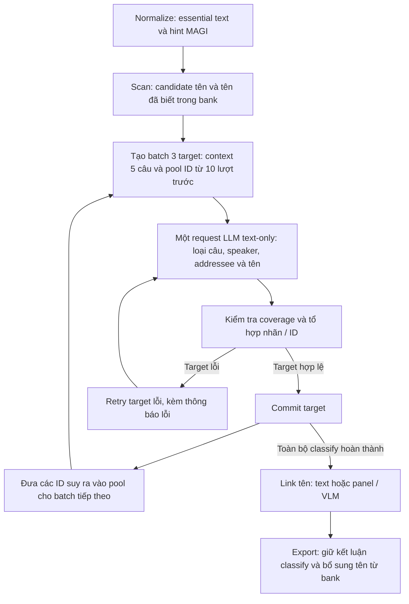

# Review nhánh phân loại câu, speaker và addressee

Ngày: 2026-10-04. Phạm vi: code đang triển khai và run `outputs/after-school-we-do/chapter-001/20261004T115947Z-569a1a27`. Đây là review trước khi thay đổi chiến lược; thiết kế trong `name_binding_strategy.md` chưa được triển khai.

**Kết luận chính:** hiện không có ba bước inference nối tiếp “phân loại câu → chọn speaker → chọn listener”. Một request LLM trả về đồng thời loại câu, speaker, addressee, vai trò tên và kết luận tên–ID. Code kiểm tra tổ hợp các kết luận rồi commit. Điểm yếu nổi bật nằm ở việc thiếu kiểm chứng ngữ nghĩa, đầu vào ứng viên hạn chế, bộ nhớ chỉ giữ ID, và không có feedback từ link về classify.

## 1. Luồng thực sự đang chạy

Đường gọi: [pipeline.py](../../src/manga_pipeline/pipeline.py), dòng 198 → [names/stages.py](../../src/manga_pipeline/names/stages.py), dòng 110 → [names/dialogue.py](../../src/manga_pipeline/names/dialogue.py), dòng 241. Nhánh essential chạy tất cả câu essential, không chỉ câu có tên. Nhánh panel link mới chỉ xuất hiện sau classify.

**Có ba contract cần phân biệt:** run không có essential policy dùng nhánh legacy; `essential-v1` dùng cùng bộ phân tích theo batch nhưng nhãn/sentinel cũ; `essential-v2` là cấu hình mặc định và contract của run đang review. Resume dùng policy đã lưu trong manifest, không tự đổi run cũ sang mặc định mới.

## 2. Normalize và scan đưa gì vào classify?

Trong essential mode, [normalization/dialogue.py](../../src/manga_pipeline/normalization/dialogue.py), dòng 54–63:

- Nonessential đưa vào `translation_only`, speaker null và listener rỗng.
- Essential có text không rỗng được giữ; loại câu bắt đầu là unknown/provisional. Heuristic narration/UI/SFX của legacy không quyết định loại câu của nhánh essential.
- Giữ source order, text gốc, box, panel và hint speaker MAGI. Không tự gộp các câu thành đoạn văn; merge chỉ chạy khi truyền nhóm merge đã xác nhận. CLI hiện tại không truyền nhóm merge.
- Vì gate dựa trên essential của MAGI, một UI bị MAGI đánh essential vẫn đi vào classify; run này có “Sort by”. Đây là hành vi theo policy đã chọn.

[names/stages.py](../../src/manga_pipeline/names/stages.py), dòng 59, scan chạy từng câu và commit riêng. NER hiện tại là GLiNER, threshold 0.85; scan còn tìm exact match của tên/alias đã biết trong bank. NER confidence đo candidate tên, không đo độ chắc chắn speaker/listener hay loại câu. Confidence không được đưa vào payload classify hiện tại; payload chỉ lấy ID candidate, tên và mapped IDs.

## 3. Đầu vào LLM và giới hạn ứng viên

[names/dialogue.py](../../src/manga_pipeline/names/dialogue.py), dòng 113 và 265:

| Đầu vào | Nội dung thực tế |
| --- | --- |
| Text context | Mỗi target tối đa ±2 essential câu, tổng 5. Đầu/cuối chương có ít hơn |
| Shared turns | Text và `source_speaker_id`; ba target dùng bảng text chung, thông thường 7 câu |
| Candidate tên | Tên thuộc target và ID đã biết trong snapshot bank |
| Identity pool | ID speaker MAGI quanh target; ID từ tên/alias đã biết; các ID MAGI/LLM trong 10 lượt trước |
| Không đưa vào | Ảnh, box, tail, panel geometry, transcript text đầy đủ của 10 lượt trước |

**Pool speaker và listener là cùng một pool**, được sao chép thành hai trường trong result; không phải hai danh sách được xếp hạng riêng. ID lấy từ speaker và listener suy ra đều mang nguồn `memory:LLM`, không giữ vai trò riêng. Danh sách cuối sắp theo ID, không theo độ tin cậy.

Không lấy toàn bộ các nhân vật detect trong panel làm ứng viên cho classify. ID phải đi vào qua source speaker, tên đã biết hoặc bộ nhớ. Vì schema cấm chọn ID ngoài pool, tăng khả năng suy luận của LLM không giúp chọn một ID chưa được cung cấp.

**Bằng chứng từ run:** MAGI detect ID 1, 2, 3, 4; nhưng pool của cả 52 target đều chỉ có ID 1 và 3. Điều này chưa chứng minh ID 2/4 cần làm speaker/listener ở một câu cụ thể, nhưng chứng minh chúng không thể được chọn trong run này.

Snapshot bank dùng cho classify ban đầu chưa có tên nào. Alias mới chỉ có thể xuất hiện trong bộ nhớ nội bộ khi một kết luận `name_target_id` ở batch trước đã thành công.

## 4. Một lượt LLM kết luận những gì?

Prompt v2: [names/dialogue_labels.py](../../src/manga_pipeline/names/dialogue_labels.py), dòng 9. Schema chung: [names/dialogue.py](../../src/manga_pipeline/names/dialogue.py), dòng 15 và 81.

| Trường | Giá trị / ràng buộc đang triển khai |
| --- | --- |
| `content_type` | dialogue, narration, thought, unknown |
| `speaker_id` | Stable ID trong pool; others; narrator chỉ cho narration |
| `addressee_type` | single, group, audience, self, unknown |
| `addressee_ids` | Stable IDs hoặc special token hợp lệ theo type |
| `mentions` | Candidate ID, mention_type và name_target_id |
| `evidence` | Một chuỗi giải thích ngắn cho toàn bộ kết luận của target |

Các ràng buộc lớn:

- Narration buộc audience / public_audience; speaker có thể là nhân vật có ID hoặc narrator. Vì vậy một thẻ giới thiệu được gán speaker MAGI vẫn có thể giữ ID đó làm người kể; code không tự phân biệt người kể và người được giới thiệu.
- Thought buộc self. Speaker đã biết dùng chính ID đó; speaker others dùng token self.
- Single có đúng một known ID hoặc unknown.
- Group có nhiều known IDs, known IDs kèm unknown, hoặc chỉ unknown cho nhóm chưa rõ danh tính.
- Audience chỉ public_audience; unknown type chỉ unknown. Dialogue cũng có thể có audience, không bắt buộc mọi lời nói tới audience là narration.
- Speaker không là listener của chính mình trừ self.

Các yêu cầu này giúp kết quả đúng contract nhưng cũng khiến **loại câu sai có thể ép loại người nghe sai**, dù chưa có cơ chế độc lập chứng minh loại câu ban đầu đúng.

## 5. Validator kiểm tra được gì, bỏ lọt gì?

Code: [names/dialogue.py](../../src/manga_pipeline/names/dialogue.py), dòng 153; [names/dialogue_labels.py](../../src/manga_pipeline/names/dialogue_labels.py), dòng 104.

Đã kiểm tra: đủ target/candidate; nhãn hợp lệ; ID thuộc pool; sentinel đúng; danh sách không trùng; cardinality theo type; quan hệ narrator/thought/self; một kết luận tên–ID không null phải là direct_address trong dialogue và trỏ tới listener hợp lệ.

**Các khoảng trống đã kiểm chứng bằng cách gọi validator, không gọi model:**

| Probe | Validator hiện tại |
| --- | --- |
| P01/T01 có “Hello, everyone” nhưng single / unknown | Chấp nhận |
| P02/T23 là narration, tên Arase Mahoru có mention_type unknown | Chấp nhận |
| P03/T06 là câu giới thiệu Madoi Ayame nhưng dialogue / single | Chấp nhận |
| P04/T03 direct_address, listener ID 1, name_target_id null | Chấp nhận |
| Thay evidence bằng một câu ngắn không liên quan | Chấp nhận |
| Probe giả lập: tên direct_address đã mapped ID 3, listener ID 1, name_target_id null | Chấp nhận |

Lý do probe cuối: code chỉ kiểm tra mapped ID và listener khi `name_target_id` khác null. Chưa có quy tắc yêu cầu kết luận tên–ID hoàn chỉnh hoặc kiểm tra tên đã biết mâu thuẫn với listener khi kết luận bị để null.

Evidence chỉ bị kiểm tra là string và dài tối đa 120 ký tự. Prompt yêu cầu tối đa 12 từ nhưng code không đếm từ, không kiểm tra trích dẫn thuộc text, không tách bằng chứng cho loại câu / speaker / listener. Không có confidence của các quyết định LLM hoặc phép đo accuracy trên bộ câu tự nhiên trong các tests đã chạy.

## 6. Retry, memory, cache và resume

[names/dialogue.py](../../src/manga_pipeline/names/dialogue.py), dòng 281; [providers/ollama.py](../../src/manga_pipeline/providers/ollama.py), dòng 26:

- Target đúng được commit ngay. Chỉ target lỗi đi vào semantic repair.
- Repair gửi lại text, pool và lỗi theo target. Không gửi JSON kết luận trước để giữ phần đúng, không có ràng buộc bảo vệ ngữ nghĩa không liên quan tới lỗi. Model có thể đổi tất cả trường để vượt validation.
- T01 có lịch sử cache group / [1, 3] → group / [3] → single / unknown. Hai kết quả đầu sai cấu trúc; kết quả cuối hợp contract nhưng mất ý nghĩa số nhiều. Đây là bằng chứng thực tế của rủi ro repair, không phải phép đo mọi lần inference.
- Có hai vòng retry: HTTP/JSON/coverage ở provider và sửa target ở caller. Với retries=1, thường một request/batch; trong tổ hợp lỗi có thể tới 4 HTTP attempts/batch. Không có cơ chế tự chia nhỏ batch khi context/output quá dài.
- Provider hiện bỏ qua cache hỏng hoặc không hợp contract; live batch có target lỗi không được cache thành công. Tuy nhiên kết quả sai ngữ nghĩa nhưng hợp contract vẫn được cache.

**Memory 10 lượt hiện chỉ là pool ID**, không lưu addressee_type, public_audience, unknown, bằng chứng người nghe, hay liên kết “câu này tiếp tục nói với đối tượng của câu trước”. Stable-ID filter loại special tokens khỏi pool. Nó cũng không đưa text cũ ngoài context ±2 vào request.

Ba target được tạo input và infer cùng lúc. Kết luận của target đầu không được commit rồi dùng tạo input của target thứ hai trong cùng batch. T01/T02/T06 cùng batch; không thể khẳng định lỗi T01 truyền tới hai câu kia qua cache đã lưu. LLM vẫn có thể diễn giải chung cả ba câu sai trong cùng request.

Batch plans được đóng băng trước inference. Sau khi repair một target ở batch cũ, plan của batch sau vẫn dùng input đã lưu, không tái xây từ kết luận mới. Đây là lựa chọn bảo vệ resume, đồng thời có nghĩa resume không tự lan truyền sửa lỗi ngữ nghĩa tới các kết quả phụ thuộc.

[storage/runs.py](../../src/manga_pipeline/storage/runs.py), dòng 68 và 101: committed step/target được kiểm tra hash và dùng lại. Unknown hợp lệ cũng là completed, không bị retry chỉ vì chưa biết ID. Đổi prompt hoặc bank không làm resume tái phân loại kết quả completed. CLI hiện chưa có lệnh sửa chọn lọc và tái tính các phụ thuộc; `reanalyze` tạo run mới và chỉ dùng lại extraction.

## 7. Link và export có sửa speaker/listener không?

**Không.** Link chạy sau khi toàn bộ classify hoàn thành. [names/stages.py](../../src/manga_pipeline/names/stages.py), dòng 216:

- Non-null name_target_id được đưa tới nhánh text direct-address link.
- Panel link chỉ nhận narration với narration_introduction/narration_reference; dialogue giới thiệu hoặc mention_type unknown bị bỏ qua.
- Không có candidate tên thì không có target panel link.
- Không có stable ID: unresolved; một stable ID và một tên mới: tự ghép; một ID nhiều tên mới: unresolved; nhiều ID và tên chưa biết: VLM. Tên đã biết không gọi lại VLM.
- Nhánh link không suy luận lại speaker/listener, kể cả sau khi xác định được tên nhân vật.

P02/T23 **đã đúng content_type narration** nhưng vai trò tên unknown chặn link. P03/T06 bị chặn cả loại câu và vai trò tên. P04/T03 bị bỏ qua vì name_target_id null và không thuộc nhánh narration. Không phải cả ba lỗi đều là sai content_type.

[pipeline.py](../../src/manga_pipeline/pipeline.py), dòng 295: export sao chép kết luận classify, lấy speaker_name từ snapshot bank và bổ sung `mentions[].referenced_id` theo tên/alias đã biết. Do đó export đã có ID tham chiếu riêng cho tên; không cần dùng speaker_id để biểu diễn người được giới thiệu.

Tên ghép qua panel ở cuối pipeline **không quay lại giúp classify của chính chương đó**. Tên gọi trực tiếp có name_target_id thành công ở batch trước là ngoại lệ: có thể giúp batch sau qua inferred_aliases. Muốn tên giới thiệu giúp inference sớm phải đổi thời điểm link hoặc có lượt đánh giá lại chọn lọc; đây là quyết định kiến trúc, không chỉ đổi prompt.

Các field nguồn như speaker_cluster_id, speaker_status, speaker_display_label và content_review_status vẫn từ normalization; export chỉ thêm source_speaker_id rồi ghi đè ID/loại câu cuối. Ví dụ một câu final narrator vẫn có source status pending_identity. Các field này không nên bị đọc như kết luận cuối của LLM.

## 8. Quan sát run và kiểm chứng

| Chỉ số | Kết quả |
| --- | --- |
| Essential / translation-only | 52 / 31 |
| Content type | 46 dialogue, 4 narration, 1 thought, 1 unknown |
| Addressee type | 45 single, 4 audience, 1 self, 2 unknown, 0 group |
| Speaker others / listener chứa unknown | 5 / 6 |
| Nguồn MAGI có stable speaker ID | 44 câu; không câu nào được đổi sang ID khác |
| Speaker chưa biết được điền stable ID | 1 câu |
| Classify plans / committed targets | 18 / 52 |
| Tên scan / tên linked | 8 / 1 (Madol-san → ID 3) |

Các tỷ lệ trên là phân bố output, **không phải accuracy**. Chưa có ground truth đầy đủ để kết luận 44 speaker MAGI đều đúng hay model bị thiên về hint.

Đã chạy 75 offline tests: pass, 6.830 giây. Tests bảo vệ contract, retry, cache, bank và resume; phần inference chủ yếu dùng fake provider, không đo khả năng hiểu câu tự nhiên của model. Các probe validator nêu trên cũng chạy thành công và không ghi bank/output của run.

Ollama hiện dùng gemma4:e4b-it-q4_K_M, think=false, temperature=0, num_ctx=8192, num_predict=768; classify không gửi ảnh. Với 52 target, một lượt đầy đủ cần ít nhất 18 batch inference nếu không có cache/retry. Hai request mẫu có 36 grammar branches và schema khoảng 32.7 KB; chưa benchmark ảnh hưởng của grammar tới latency. Cấu hình device của extraction/NER không được truyền thành thiết lập GPU riêng trong request Ollama.

## 9. Các quyết định chiến lược mà review làm rõ

| Điểm cần quyết định | Vì sao ảnh hưởng kết quả / chi phí |
| --- | --- |
| Giữ joint inference hay tách các quyết định trong cùng request / nhiều request | Hiện loại câu và ID cùng được chọn; tách thành nhiều inference sẽ tăng số gọi model |
| Pool ứng viên lấy từ đâu và phân biệt vai trò thế nào | Model không thể chọn ID ngoài pool; hiện speaker/listener dùng chung ID và nguồn |
| Bộ nhớ đối tượng hội thoại hay chỉ pool ID | Pool hiện không bảo toàn người nghe tập thể hoặc lý do kế thừa |
| Ràng buộc repair giữ phần ngữ nghĩa đúng | Hiện sửa ID có thể đổi luôn type; structural validation không phát hiện sai nghĩa |
| Thời điểm ghép tên giới thiệu | Link cuối chương không cung cấp tên cho các quyết định trước đó |
| Sửa chọn lọc và đánh dấu kết quả phụ thuộc | Resume hiện ưu tiên giữ kết quả cũ, không tự đánh giá lại phụ thuộc |
| Bộ câu kiểm thử có nhãn và nhiều cách diễn đạt | 75 tests pass chưa chứng minh semantic accuracy hoặc độ tổng quát |

Các thay đổi đã bàn ở `name_binding_strategy.md` vẫn là thiết kế chờ triển khai. Review này không áp dụng các thay đổi đó vào pipeline và không chạy lại model/chapter.
