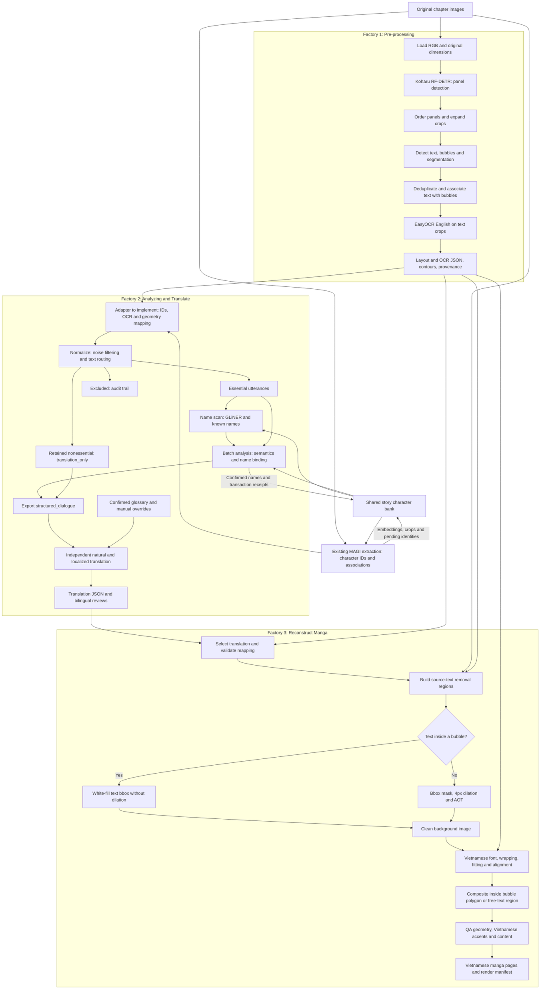
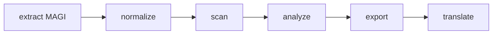
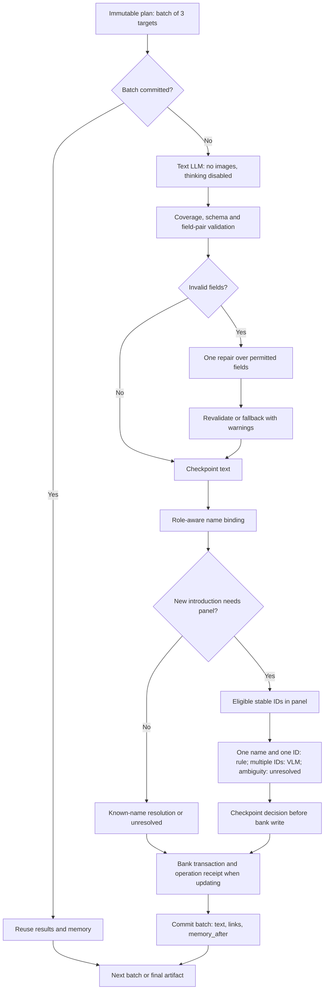

# Manga pipeline: three factories and the complete workflow

Checked on 2026-10-06. [Bản tiếng Việt](pipeline_summary_vi.md).

Sources: the current repository, `configs/pipeline.json`, and the reference document `D:\download\README (1).md`. Koharu/EasyOCR/AOT details below come from that README; its implementation has not been inspected.

## 1. Architecture and implementation status

| Factory | Responsibility | Status |
|---|---|---|
| **Pre-processing** | Load images, detect panels/text/bubbles, segmentation, OCR and geometry preservation | Described in the reference README; not directly integrated into this repository |
| **Analyzing and Translate** | Character identities, normalization, name scanning, speaker/listener analysis, name binding, export and Vietnamese translation | Implemented here; default orchestration is v4 |
| **Reconstruct Manga** | Remove source text/inpaint, typeset Vietnamese and composite translated pages | Text removal/AOT exists in the reference README; Vietnamese rendering and end-to-end integration remain to be implemented |

Factories divide responsibilities in the overall architecture. The reference runner currently combines detection/OCR with text removal; this document assigns removal/inpainting to the final factory. The repository still performs its own MAGI extraction and does not ingest Koharu/EasyOCR JSON directly. Connected diagrams describe the target integration workflow, not already implemented adapters.

## 2. Fully connected workflow



Excluded text is not translated. `translation_only` reaches export/translation without essential dialogue speaker/listener inference. Translations join image regions through explicit ID mappings, not array order or matching text strings.

## 3. Pre-processing factory

### 3.1. Panels and reading order

`MangaPipeline.process()` loads RGB images. `MangaDetector.detect_with_panels()` uses Koharu RF-DETR segmentation to detect panels across the page; if none are found, the whole page becomes a fallback panel. Panels are ordered top-to-bottom and right-to-left within each row. Panel crops expand by `max(64, 8% of page height)` pixels to retain bubbles near panel boundaries.

This is the README's ordering heuristic. MAGI reading order in this repository is a different source. The adapter must preserve provenance and explicitly choose a canonical ordering instead of silently mixing them.

### 3.2. Text/bubble detection and segmentation

| Class | Label | Confidence threshold in README |
|---|---|---:|
| 0 | `text` | 0.20 |
| 2 | `bubble` | 0.25 |
| 3 | `panel` | 0.50 |

The model returns bounding boxes and segmentation masks. Text is assigned to a bubble when contained in or significantly overlapping its bbox; unassigned text is free text. Same-class duplicates are filtered before reading order is numbered.

`bbox` is `[x1, y1, x2, y2]` in original-image pixels. `bubble_contour` is a simplified mask polygon with **absolute** `[x, y]` vertices, not coordinates relative to a crop/bbox. `bubble_bbox` encloses the bubble. Bubble detections are containers, not OCR crops.

### 3.3. OCR and artifacts

EasyOCR configured for `en` reads each `label: text` crop into `ocr_text`, which can be empty. The reference does not implement Japanese OCR or automatic translation. Detector `confidence` must not be treated as OCR confidence.

| Reference artifact | Contents |
|---|---|
| `result.json` | Image dimensions, statistics, panels, detections, OCR, boxes and contours |
| `annotated.jpg` | Bubble contours and pink free-text boxes; panel/in-bubble text boxes hidden by default |
| `crops/` | Detection crops unless `--no-crops` is selected |
| `layout.json`, `annotated_layout.jpg`, `panels/` | Standalone layout detection, without the full OCR/text-bubble/inpainting output |

Detection fields are page-unique `id`, `reading_order`, `panel_id`, `label`, `bbox`, `is_bubble`, `bubble_id`, `bubble_bbox`, `bubble_contour`, `confidence` and `ocr_text`. Free text has `bubble_id: 0` and null bubble bbox/contour. Namespace IDs by page/chapter before joining across a chapter.

## 4. Contract between the first two factories

The adapter is not implemented here. Preserve upstream JSON and add a sidecar mapping rather than modifying committed source schemas/receipts.

| Data to preserve | Purpose |
|---|---|
| Story/chapter/page IDs, image hash, width/height | Verify image identity and coordinate system |
| Detection ID and canonical source text ID | Join OCR to utterance/translation target and render region |
| Panel IDs and reading-order provenance | Keep Koharu and MAGI layout references distinguishable |
| Original OCR, selected OCR and selection reason | Audit differences between MAGI and EasyOCR |
| Text bbox, bubble ID/bbox/contour | Remove source text and place translations correctly |
| MAGI associations, essential flags and stable character IDs | Supply metadata not described by the reference detector/OCR |
| Match status, confidence/provenance and review flags | Block ambiguous mappings before reconstruction |

Spatial overlap on the same source image can help align boxes. One-to-many or many-to-one matches require explicit mappings. A bubble ID is not a character ID. English OCR configuration in the reference does not establish that every source is English.

## 5. Analyzing and Translate factory: current code

The default executable workflow remains:



| v4 stage | Processing and outputs |
|---|---|
| `01_extract` | MAGI `ragavsachdeva/magiv2`: OCR/panel/character detection, essential flags and text-character associations. Separate worker releases PyTorch before later providers; raw output retains all OCR boxes |
| `02_normalize` | `whole-box-rules-v1`: snapshotted noise rules, essential `utterances`, retained `translation_only`, `excluded` and provenance validation |
| `03_scan` | GLiNER `gliner-community/gliner_small-v2.5`, pinned revision, threshold 0.85, CPU; additional known-name string matching; NER produces candidates |
| `04_analyze` | Text semantics, validation/repair, role-aware name binding and panel decisions; utterances/links/warnings/batches |
| `05_export` | `structured_dialogue`, speaker/listener, names, mentions, source geometry/provenance and limitations; `dialogue.json` and `translation_only.json` |
| `06_translate` | `vi-dual-v1`: independent styles, revisions and checkpoints per source ID/style |

### 5.1. Identity and character bank

`banks/<story-id>/` is shared across chapters. MAGI clusters are page-local; `DynamicCharacterAssigner` uses embeddings/prototypes to maintain persistent IDs and save crops. Unconfirmed observations remain pending, matching only within three consecutive pages of the same chapter counted from the starting page; supported identities can be promoted. Stable IDs can still fragment or match incorrectly. Names and IDs are separate layers, and automatic updates protect manual display names.

### 5.2. Detailed analysis and checkpoints



Batches have 3 targets. Each target has up to five essential turns (two preceding, itself, two following); memory covers up to ten previously processed turns. Main fields are `content_type` (`dialogue/narration/thought/unknown`), `speaker_id`, `addressee_type`, `addressee_ids`, `mentions`, `evidence`, candidate pools and warnings. MAGI speaker associations are fallible hints.

`individual-v1` permits supported stable IDs, `others` or `narrator`; `groups` is disabled for new runs. `others` is not a persistent person across turns. `narrator` requires narration, but narration can also be spoken by a character/others. Invalid text after one repair receives conservative fallback and warnings; completion does not mean every identity is certain.

Only eligible scanned introductions open panel images. Pending identities cannot receive names; IDs are not automatically merged and aliases are not inferred from similar names. VLM can select only eligible panel stable IDs or null. Insufficient evidence/conflicts remain unresolved. Saved decisions and operation receipts prevent repeated model calls/bank writes when sufficient checkpoints exist.

### 5.3. Export and translation styles

Export preserves `source_speaker_id` alongside the analyzed speaker. `name_target_id` records the binding conclusion; `model_name_target_id` retains the initial text suggestion; `referenced_id` resolves against the export-time bank when a name maps uniquely.

Translation reads both text buckets, validates unique IDs and sorts by source position. Models do not rewrite speaker/listener identities or the bank. `natural` preserves meaning and tone; `localized` allows more colloquial phrasing while preserving content. The contract preserves proper names and Japanese honorifics. Current defaults: batch 3, context radius 2 and `num_predict` 1536.

Only `confirmed: true` glossary entries enter prompts/validation; proposals are not automatically confirmed. Manual overrides lock by ID/style. Each batch/style permits one repair; remaining errors stay failed/partial for retry, not successful English fallbacks. `translations/vi/<revision>/` contains `natural.json`, `localized.json`, `result.json`, two `review_*.md` files and snapshots/plans/attempts/targets. Parent `latest.json` points to the latest executed revision. `TranslationContextProvider` is an extension interface without a default character graph/profile provider.

## 6. Reconstruct Manga factory

### 6.1. Text removal and inpainting in the README

- In-bubble text: white-fill the **text bbox**, without dilation, preserving the remaining bubble.
- Free text: bbox mask, default 4-pixel dilation and AOT background restoration. `--white-fill` replaces AOT with white fill.
- AOT is skipped when there is no free text. `--inpaint-backend auto` prefers available CUDA; explicit CPU/CUDA options exist.
- `inpainted.png` is a cleaned image and **contains no translation**.

The reference runner can prepare clean backgrounds before translation; functionally this artifact belongs to reconstruction. Do not remove every detected text region before deciding which regions are translated or retained. If excluded text has no translation, rendering policy must explicitly retain the original or intentionally remove it, avoiding unintended blank regions.

### 6.2. Vietnamese rendering: workflow to implement

1. Select a revision and `natural` or `localized` style; accept successful/manual targets and leave failed targets for review.
2. Join source IDs through the sidecar mapping, obtain text/bubble geometry and verify source image hashes/dimensions.
3. Normalize Unicode and select a font supporting Vietnamese accents; measure glyphs, line heights and spacing.
4. Use `bubble_bbox` for layout bounds and `bubble_contour` for polygon containment, with inward padding. The old text bbox is not the full bubble layout area.
5. Wrap text, fit font size and center it; ensure glyph bounds stay within the safe region. Multiple text boxes in one bubble require a shared ordered layout to avoid collisions.
6. Lay out free text appropriately against the restored background; a null contour must not be treated as a bubble.
7. Composite at original coordinates and export translated pages plus a manifest recording source IDs, revision/style, fonts, positions, statuses and warnings.
8. Check clipped accents, polygon overflow, overlapping text, damaged bubble borders, inpainting defects and missing translations. Review unresolved pages before marking them complete.

Font fitting, typesetting and render manifests above are proposed designs, not implemented in this repository or the reference README.

## 7. Current storage and operation

Runs live in `outputs/<story-id>/<chapter-id>/<run-id>/`, containing `manifest.json`, `snapshots/`, `review.md`, `logs/magi.log`, six v4 stage directories and `translations/vi/`. Stages store `result.json`/reviews, receipts and target checkpoints. RunStore verifies hashes/configuration, reuses completed stages and recovers receipts between artifact writes and manifest updates. Run locks and bank transactions guard concurrent/duplicate writes. Inference interrupted before journaling may run again; abrupt termination can lose timing not yet checkpointed.

```powershell
python run.py run "D:\path\chapter" --story "Story title" --chapter "chapter-001" --config configs/pipeline.json
python run.py resume --run-dir "<run-directory>"
python run.py reanalyze --run-dir "<source-run-directory>" --config configs/pipeline.json
python run.py translate --run-dir "<run-directory>" --config configs/pipeline.json
python run.py review --run-dir "<run-directory>"
```

`reanalyze` creates a new run reusing extraction while sharing the bank. Standalone `translate` requires a committed export and does not rewrite source export/manifest; use it after manual override changes, since resuming a committed translation stage reuses its artifact. Exit codes: 0 complete, 2 partial, 1 error, 130 Ctrl+C.

v2 retains `extract → normalize → scan → classify → link → export`; v3 retains `extract → normalize → scan → analyze → export`; v4 adds translate after export. Do not upgrade by editing snapshots/manifests. `pipeline_version: 4` is distinct from analysis policy `essential-v3`.

## 8. Limitations and source references

Missing integration pieces are preprocessing JSON ingestion, Koharu–MAGI mapping, geometry handoff and the Vietnamese renderer. OCR/identity/semantic errors can propagate into translation; valid schemas do not prove correct meaning. Difficult bubble segmentation/reading order needs review. Incorrect white-fill boxes can damage borders; bbox-based AOT can affect background beyond glyphs.

Code: [orchestrator](../src/manga_pipeline/pipeline.py), [RunStore](../src/manga_pipeline/storage/runs.py), [MAGI](../src/manga_pipeline/extraction/magi.py), [identity](../src/manga_pipeline/bank/assignment.py), [normalize](../src/manga_pipeline/normalization/dialogue.py), [scan](../src/manga_pipeline/names/stages.py), [analyze](../src/manga_pipeline/analysis/stage.py), [binding](../src/manga_pipeline/analysis/binding.py), [translation](../src/manga_pipeline/translation/stage.py), [configuration](../configs/pipeline.json).
