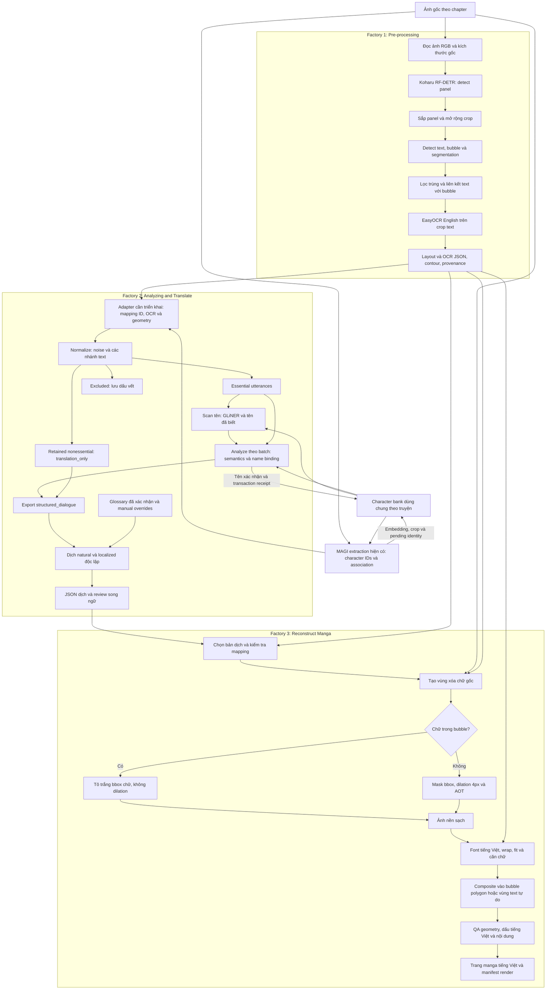
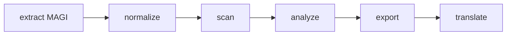
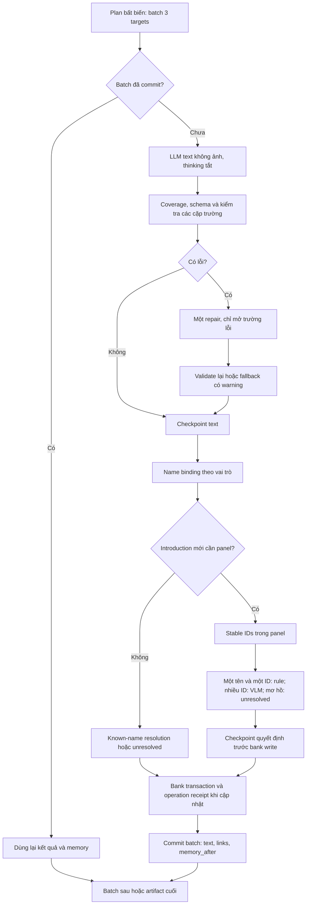

# Pipeline manga: ba factory và workflow đầu cuối

Ngày đối chiếu: 06/10/2026. [English version](pipeline_summary_en.md).

Nguồn: mã nguồn repository hiện tại, `configs/pipeline.json` và tài liệu tham chiếu `D:\download\README (1).md`. Các mô tả Koharu/EasyOCR/AOT dưới đây theo README, chưa được xác minh bằng mã nguồn của dự án đó.

## 1. Kiến trúc tổng thể và trạng thái

| Factory | Trách nhiệm | Trạng thái |
|---|---|---|
| **Pre-processing** | Đọc ảnh, detect panel, detect text/bubble, segmentation, OCR và giữ geometry | Được mô tả trong README tham chiếu; chưa nối trực tiếp vào repository này |
| **Analyzing and Translate** | Nhận diện nhân vật, normalize, scan tên, phân tích speaker/listener, ghép tên, export và dịch tiếng Việt | Có trong code hiện tại; mặc định pipeline v4 |
| **Reconstruct Manga** | Xóa chữ gốc/inpaint, dàn chữ tiếng Việt và ghép lên trang | Xóa chữ/AOT có trong README; renderer tiếng Việt và tích hợp đầu cuối là phần cần triển khai |

Phân chia factory là kiến trúc tổng thể theo chức năng. README hiện chạy cả detect/OCR và xóa chữ trong một runner; tài liệu này đặt xóa chữ/inpaint vào factory cuối. Code hiện tại vẫn tự extraction bằng MAGI, chưa nhận trực tiếp JSON Koharu/EasyOCR. Sơ đồ nối đầy đủ mô tả workflow tích hợp mục tiêu, không khẳng định các adapter đã tồn tại.

## 2. Workflow nối hoàn chỉnh



`Excluded` không đi vào bản dịch. Text `translation_only` đi đến export/dịch mà không được suy luận speaker/listener như essential utterances. Bản dịch được join với vùng ảnh bằng mapping ID, không bằng thứ tự array hoặc text giống nhau.

## 3. Factory Pre-processing

### 3.1. Panel detection và thứ tự đọc

`MangaPipeline.process()` đọc ảnh RGB. `MangaDetector.detect_with_panels()` dùng Koharu RF-DETR segmentation detect panel toàn trang; không tìm thấy panel thì dùng toàn trang làm panel thay thế. Panel được sắp từ trên xuống, từ phải sang trái trong mỗi hàng. Crop panel mở rộng thêm `max(64, 8% chiều cao trang)` pixel để tránh cắt bubble gần biên.

Đây là heuristic của README. Thứ tự đọc MAGI trong repository là một nguồn khác; adapter phải giữ cả provenance và chọn một thứ tự canonical rõ ràng, không âm thầm trộn hai thứ tự.

### 3.2. Text/bubble detection và segmentation

| Class | Nhãn | Confidence threshold theo README |
|---|---|---:|
| 0 | `text` | 0.20 |
| 2 | `bubble` | 0.25 |
| 3 | `panel` | 0.50 |

Model trả bbox và segmentation mask. Text được gán vào bubble nếu nằm trong hoặc giao đáng kể với bbox bubble. Text không gán được là chữ tự do. Detection trùng cùng loại được lọc trước khi đánh reading order.

`bbox` là `[x1, y1, x2, y2]` pixel trên ảnh gốc. `bubble_contour` là polygon rút gọn từ mask, với đỉnh `[x, y]` **tuyệt đối**, không tương đối theo crop/bbox. `bubble_bbox` là hình chữ nhật bao quanh bubble. Bubble detection là vùng chứa, không phải vùng OCR.

### 3.3. OCR và artifact

EasyOCR cấu hình `en` đọc từng crop có `label: text`, lưu `ocr_text`; kết quả có thể rỗng. README chưa hỗ trợ OCR tiếng Nhật hoặc dịch tự động. Không suy confidence OCR từ `confidence` detector.

| Artifact tham chiếu | Nội dung |
|---|---|
| `result.json` | Kích thước ảnh, thống kê, panels, detections, OCR, bbox và contour |
| `annotated.jpg` | Contour bubble và bbox hồng của chữ tự do; mặc định không vẽ panel/bbox chữ trong bubble |
| `crops/` | Crop detection, trừ khi dùng `--no-crops` |
| `layout.json`, `annotated_layout.jpg`, `panels/` | Đầu ra detect layout riêng, chưa bao gồm toàn bộ OCR/text-bubble/inpaint |

Detection gồm `id` duy nhất trong trang, `reading_order`, `panel_id`, `label`, `bbox`, `is_bubble`, `bubble_id`, `bubble_bbox`, `bubble_contour`, `confidence`, `ocr_text`. Text tự do có `bubble_id: 0`, bbox/contour bubble là `null`. Phải namespace detection ID theo trang/chapter trước khi join xuyên chapter.

## 4. Hợp đồng nối giữa hai factory đầu

Adapter chưa có trong code hiện tại. Đề xuất giữ nguyên JSON upstream và tạo sidecar mapping, để không sửa schema/receipt nguồn đã commit.

| Dữ liệu phải giữ | Mục đích |
|---|---|
| Story/chapter/page ID, source image hash, width/height | Xác nhận đúng ảnh và hệ tọa độ |
| Source detection ID và canonical source text ID | Nối OCR → utterance/translation target → vùng render |
| Panel ID và nguồn reading order | Tránh nhầm panel/thứ tự của Koharu với MAGI |
| OCR nguồn, OCR được chọn và lý do chọn | MAGI và EasyOCR có thể đọc khác nhau; không ghi đè không dấu vết |
| Text bbox, bubble ID/bbox/contour | Xóa chữ và dàn chữ đúng vùng |
| MAGI association, essential flag và stable character ID | Cung cấp metadata mà README detect/OCR không mô tả |
| Match status, confidence/provenance và review flags | Chặn mapping mơ hồ trước reconstruct |

Có thể đối chiếu bbox theo vị trí/giao vùng trên cùng ảnh, nhưng trường hợp một box ghép nhiều box hoặc ngược lại phải có mapping tường minh. Bubble ID không phải character ID. Không dùng OCR English từ README để ngầm kết luận toàn bộ nguồn đều English.

## 5. Factory Analyzing and Translate: code hiện tại

Workflow executable mặc định vẫn là:



| Stage v4 | Xử lý và đầu ra |
|---|---|
| `01_extract` | MAGI `ragavsachdeva/magiv2`: OCR/panel/character detection, essential flag và text-character association. Worker riêng giải phóng PyTorch trước provider sau; raw document giữ mọi OCR box |
| `02_normalize` | `whole-box-rules-v1`: noise rules snapshot, tách essential `utterances`, retained `translation_only` và `excluded`; validate provenance |
| `03_scan` | GLiNER `gliner-community/gliner_small-v2.5`, revision pin, threshold 0.85, CPU; tìm thêm tên đã biết bằng chuỗi; NER chỉ tạo candidate |
| `04_analyze` | Text semantics, validate/repair, binding tên theo vai trò và panel; output utterances/links/warnings/batches |
| `05_export` | `structured_dialogue`, speaker/listener, tên, mentions, source geometry/provenance, limitations; `dialogue.json` và `translation_only.json` |
| `06_translate` | `vi-dual-v1`: hai phong cách độc lập, revision và checkpoint từng source ID/phong cách |

### 5.1. Identity và character bank

Bank tại `banks/<story-id>/` dùng chung giữa các chapter. Cluster MAGI vốn page-local; `DynamicCharacterAssigner` dùng embedding/prototype để duy trì ID và lưu crop. Quan sát chưa đủ chắc nằm ở pending; pending chỉ match trong ba trang liên tiếp cùng chapter tính từ trang bắt đầu, có thể promote khi đủ bằng chứng. Stable ID vẫn có thể bị fragmentation/match sai. Tên và ID là hai tầng riêng; tên thủ công được bảo vệ khi cập nhật tự động.

### 5.2. Analyze chi tiết và checkpoint



Batch 3 target; mỗi target có tối đa năm essential turns (hai trước, chính nó, hai sau), memory tối đa mười lượt đã xử lý trước đó. Trường chính: `content_type` (`dialogue/narration/thought/unknown`), `speaker_id`, `addressee_type`, `addressee_ids`, `mentions`, `evidence`, candidate pool và warnings. MAGI speaker là gợi ý có thể sai.

`individual-v1` cho speaker là stable ID hợp lệ, `others` hoặc `narrator`; `groups` bị tạm ngừng trong run mới. `others` không phải một người cố định xuyên lượt. `narrator` yêu cầu narration, nhưng narration có thể do nhân vật/others nói. Text lỗi sau một repair được fallback bảo thủ và ghi warning; completed không có nghĩa mọi identity đã chắc chắn.

Chỉ scanned introduction phù hợp mở panel. Không đặt tên cho pending, không tự merge ID hay suy alias từ tên gần giống. VLM chỉ chọn ID ổn định trong panel hoặc null; thiếu bằng chứng/xung đột giữ unresolved. Quyết định và operation receipt giúp resume không gọi lại/ghi bank trùng khi đã lưu đủ checkpoint.

### 5.3. Export và hai phong cách dịch

Export giữ `source_speaker_id` và speaker sau analyze. `name_target_id` là kết luận binding, `model_name_target_id` là gợi ý text ban đầu, `referenced_id` tra bank tại thời điểm export khi tên có một identity duy nhất.

Adapter dịch đọc cả `utterances` và `translation_only`, kiểm tra ID duy nhất và sort theo vị trí nguồn. Model dịch không sửa speaker/listener hay bank. `natural` bám nghĩa và giọng nhân vật; `localized` khẩu ngữ linh hoạt hơn nhưng giữ nội dung. Contract giữ proper names và honorific Nhật. Batch 3, context radius 2, `num_predict` 1536 theo config hiện tại.

Chỉ glossary `confirmed: true` vào prompt/validation; đề xuất không tự xác nhận. Manual override khóa theo ID và phong cách. Mỗi batch/phong cách có một repair; lỗi còn lại giữ failed/partial để retry, không coi English fallback là thành công. Revision ở `translations/vi/<revision>/` gồm `natural.json`, `localized.json`, `result.json`, hai `review_*.md`, snapshots/plans/attempts/targets; `latest.json` ở thư mục cha trỏ revision vừa chạy. Extension `TranslationContextProvider` có interface nhưng chưa có provider graph/hồ sơ mặc định.

## 6. Factory Reconstruct Manga

### 6.1. Xóa chữ và inpaint theo README

- Text trong bubble: tô trắng **bbox chữ**, không mở rộng bbox, để giữ phần bubble còn lại.
- Text tự do: tạo mask bbox, dilation mặc định 4 pixel, chạy AOT phục hồi nền. `--white-fill` thay AOT bằng tô trắng.
- Không có text tự do thì không gọi AOT. `--inpaint-backend auto` ưu tiên CUDA nếu có, có lựa chọn CPU/CUDA rõ ràng.
- `inpainted.png` là ảnh đã xóa chữ, **chưa chứa bản dịch**.

Runner tham chiếu có thể tạo nền sạch trước khi dịch; xét theo chức năng, artifact này được factory reconstruct sử dụng. Không xóa toàn bộ text trước khi biết vùng nào sẽ được dịch/giữ nguyên: nếu `excluded` không có bản dịch, policy render phải quyết định giữ chữ gốc hoặc loại có chủ đích để tránh ô trống ngoài ý muốn.

### 6.2. Chèn chữ tiếng Việt: workflow cần triển khai

1. Chọn revision và phong cách `natural` hoặc `localized`; chỉ nhận câu đã thành công/manual, giữ failed để review.
2. Join source ID với sidecar mapping, lấy text bbox và bubble geometry; kiểm tra hash ảnh/kích thước.
3. Chuẩn hóa Unicode và dùng font hỗ trợ đầy đủ dấu tiếng Việt; đo glyph, line height và khoảng cách.
4. Với bubble, dùng `bubble_bbox` làm vùng bố cục và `bubble_contour` làm ràng buộc polygon, có padding bên trong. Không xem bbox chữ cũ là toàn bộ không gian bubble.
5. Wrap câu, chọn font size, căn giữa; kiểm tra toàn bộ vùng glyph nằm trong vùng an toàn. Nhiều text box chung bubble cần bố cục chung theo mapping và thứ tự, tránh render đè.
6. Text tự do dùng vùng bố cục phù hợp, giữ tương quan với nền đã inpaint; contour null không được xử lý như bubble.
7. Composite lên ảnh sạch ở đúng tọa độ, xuất trang dịch và manifest chứa source ID, revision/style, font, vị trí, trạng thái và cảnh báo.
8. QA dấu bị cắt, tràn polygon, chữ đè nhau, mất viền bubble, vùng inpaint lỗi và câu thiếu. Trang chưa đạt cần review trước khi xem là hoàn thành.

Font fitting, typesetting và manifest render ở trên là thiết kế đề xuất, chưa có implementation trong repository hoặc README.

## 7. Lưu trữ và vận hành hiện tại

Run tại `outputs/<story-id>/<chapter-id>/<run-id>/`: `manifest.json`, `snapshots/`, `review.md`, `logs/magi.log`, sáu thư mục stage v4 và `translations/vi/`. Mỗi stage có `result.json`/review; receipt và target checkpoint phục vụ resume. RunStore xác minh hash/config, dùng lại completed step, phục hồi receipt giữa artifact write và manifest update. Run lock và bank transaction tránh ghi đồng thời/trùng. Inference chưa journal khi ngắt có thể phải gọi lại; timing chưa checkpoint khi kill có thể thiếu.

```powershell
python run.py run "D:\path\chapter" --story "Story title" --chapter "chapter-001" --config configs/pipeline.json
python run.py resume --run-dir "<run-directory>"
python run.py reanalyze --run-dir "<source-run-directory>" --config configs/pipeline.json
python run.py translate --run-dir "<run-directory>" --config configs/pipeline.json
python run.py review --run-dir "<run-directory>"
```

`reanalyze` tạo run mới tái dùng extraction, bank vẫn chung. `translate` riêng yêu cầu export commit, không viết lại source export/manifest; dùng lệnh này sau sửa manual override vì resume stage translate đã commit vẫn dùng artifact cũ. Exit code: 0 completed, 2 partial, 1 error, 130 Ctrl+C.

Run v2 giữ `extract → normalize → scan → classify → link → export`; v3 giữ `extract → normalize → scan → analyze → export`; v4 thêm translate sau export. Không sửa snapshot/manifest để nâng phiên bản. `pipeline_version: 4` khác với analysis policy `essential-v3`.

## 8. Giới hạn và tham chiếu code

Các điểm chưa nối: ingestion preprocessing JSON, mapping Koharu–MAGI, chuyển geometry đến renderer và renderer tiếng Việt. OCR/identity/semantics sai có thể truyền đến bản dịch; output hợp schema không đảm bảo đúng nghĩa. Bubble segmentation và reading order khó cần review; white-fill có thể ảnh hưởng viền nếu bbox sai, AOT theo bbox có thể tác động nền ngoài glyph.

Code: [orchestrator](../src/manga_pipeline/pipeline.py), [RunStore](../src/manga_pipeline/storage/runs.py), [MAGI](../src/manga_pipeline/extraction/magi.py), [identity](../src/manga_pipeline/bank/assignment.py), [normalize](../src/manga_pipeline/normalization/dialogue.py), [scan](../src/manga_pipeline/names/stages.py), [analyze](../src/manga_pipeline/analysis/stage.py), [binding](../src/manga_pipeline/analysis/binding.py), [translation](../src/manga_pipeline/translation/stage.py), [config](../configs/pipeline.json).
