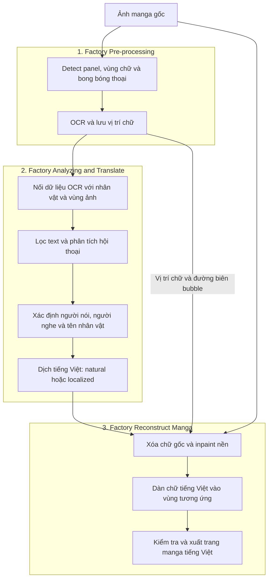
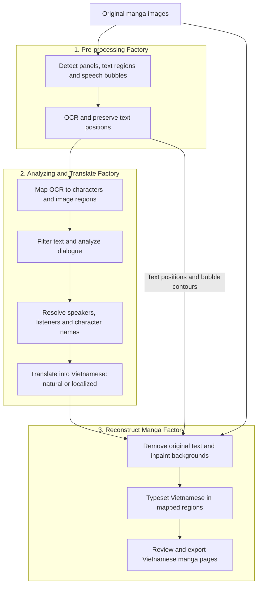

# Manga Translation Workflow

## Tiếng Việt

| Factory | Công việc chính | Đầu ra |
|---|---|---|
| **Pre-processing** | Detect panel, text và bubble bằng Koharu RF-DETR; đọc chữ bằng EasyOCR | Text OCR, thứ tự đọc, bbox và contour bubble |
| **Analyzing and Translate** | Nhận diện nhân vật bằng MAGI; lọc text, phân tích hội thoại, ghép tên và dịch | Bản dịch tiếng Việt gắn với ID và metadata nguồn |
| **Reconstruct Manga** | Tô trắng chữ trong bubble, AOT inpaint chữ tự do, dàn chữ tiếng Việt | Trang manga đã thay chữ và kết quả kiểm tra |

**Trạng thái:** Sơ đồ là workflow tích hợp mục tiêu. Code hiện tại đã có MAGI → normalize → scan → analyze → export → translate. Adapter nối dữ liệu pre-processing và renderer tiếng Việt cần được triển khai; detect/OCR và xóa chữ/inpaint được mô tả trong README tham chiếu.

**Nguyên tắc nối:** Giữ ID và tọa độ nguồn xuyên suốt để bản dịch quay về đúng vùng chữ trên trang.

Chi tiết: [Pipeline tiếng Việt](pipeline_summary_vi.md).

## English

| Factory | Main work | Output |
|---|---|---|
| **Pre-processing** | Koharu RF-DETR panel/text/bubble detection and EasyOCR | OCR text, reading order, bounding boxes and bubble contours |
| **Analyzing and Translate** | MAGI character identification, text filtering, dialogue analysis, name binding and translation | Vietnamese translations linked to source IDs and metadata |
| **Reconstruct Manga** | White-fill in-bubble text, AOT inpaint free text and typeset Vietnamese | Translated manga pages and review results |

**Status:** This diagram describes the target integrated workflow. Current code implements MAGI → normalize → scan → analyze → export → translate. The pre-processing adapter and Vietnamese renderer remain to be implemented; detection/OCR and text removal/inpainting are described in the reference README.

**Integration principle:** Preserve source IDs and coordinates throughout so each translation returns to its correct image region.

Details: [English pipeline](pipeline_summary_en.md).
